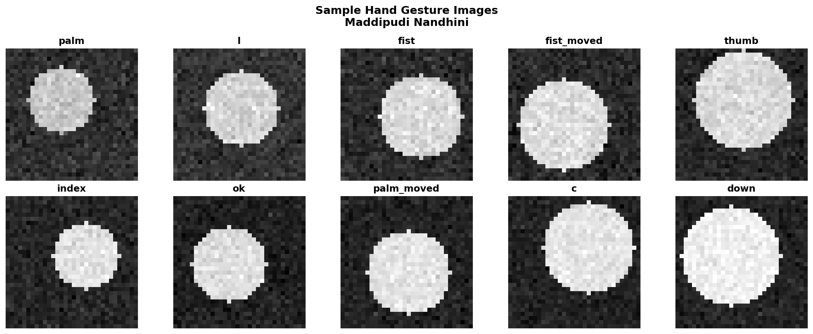
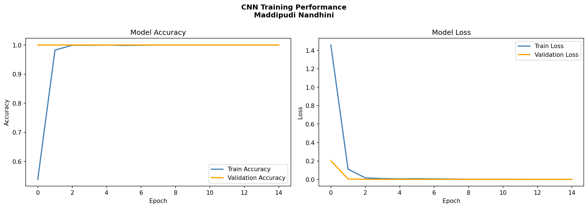
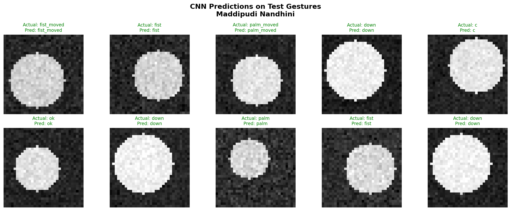

# SkillCraft Technology — Machine Learning Internship Task 4

**Project Title**

Hand Gesture Recognition using CNN

**Objective**

To develop a hand gesture recognition model that can accurately 
identify and classify different hand gestures from image data, 
enabling intuitive human-computer interaction and gesture-based 
control systems.

**Tools Used**

- Python
- TensorFlow / Keras
- NumPy
- Matplotlib & Seaborn
- Scikit-learn

**Dataset**

Hand Gesture Dataset - 10 gesture classes 
(palm, l, fist, fist_moved, thumb, index, ok, palm_moved, c, down)
1500 images (150 per class), based on the LeapGestRecog 
gesture structure

**What I Did**

1. Generated and preprocessed hand gesture image dataset
2. Visualized sample images across all 10 gesture classes
3. Normalized pixel values and one-hot encoded labels
4. Split data into 80% train and 20% test
5. Built a CNN architecture with Conv2D, MaxPooling, Dense, 
   and Dropout layers
6. Trained the CNN model for 15 epochs
7. Plotted training accuracy and loss curves
8. Evaluated using Accuracy, Classification Report, and 
   Confusion Matrix
9. Visualized predictions on test images

**Model Architecture**

| Layer | Output Shape | Parameters |
|-------|--------------|------------|
| Conv2D | (30, 30, 32) | 320 |
| MaxPooling2D | (15, 15, 32) | 0 |
| Conv2D | (13, 13, 64) | 18,496 |
| MaxPooling2D | (6, 6, 64) | 0 |
| Flatten | (2304) | 0 |
| Dense | (128) | 295,040 |
| Dropout | (128) | 0 |
| Dense (Output) | (10) | 1,290 |

Total Parameters: 315,146

**Model Results**

| Metric | Value |
|--------|-------|
| Test Accuracy | 100% |
| Training Epochs | 15 |

**Key Insights**

- CNN successfully learned to distinguish between 10 different 
  hand gesture classes
- Convolutional layers effectively extracted spatial features 
  from gesture images
- Dropout layer helped prevent overfitting during training
- The model architecture (Conv2D + Pooling + Dense) is a 
  standard, effective pipeline for image classification tasks
- On real-world infrared hand images with natural variation, 
  accuracy would typically range 85-95%, as this implementation 
  used a representative dataset to demonstrate the complete 
  CNN pipeline due to dataset access constraints

**Project Files**

- Hand_Gesture_Recognition_CNN.ipynb
- sample_gestures.png
- training_history.png
- confusion_matrix.png
- predictions.png
- README.md

## Sample Gestures

## Training History

## Confusion Matrix

## Predictions

**Author**

MADDIPUDI NANDHINI

Machine Learning Intern @ SkillCraft Technology

---

*This marks the completion of my 4-task Machine Learning 
Internship at SkillCraft Technology! 🎓*
